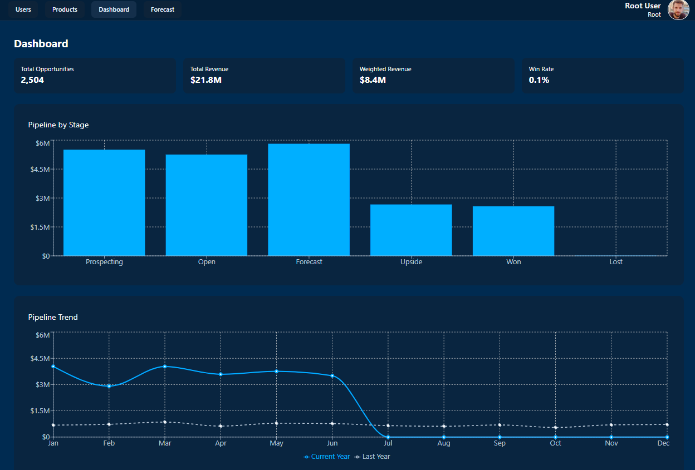
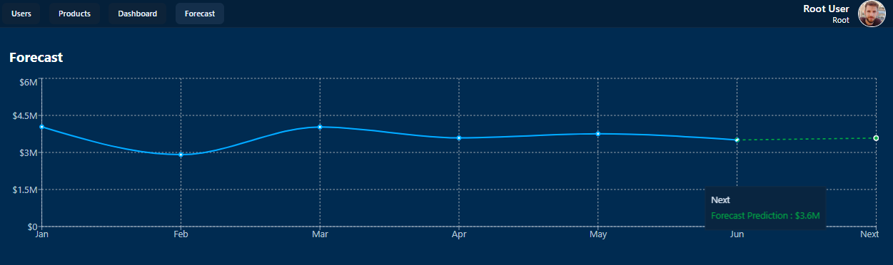
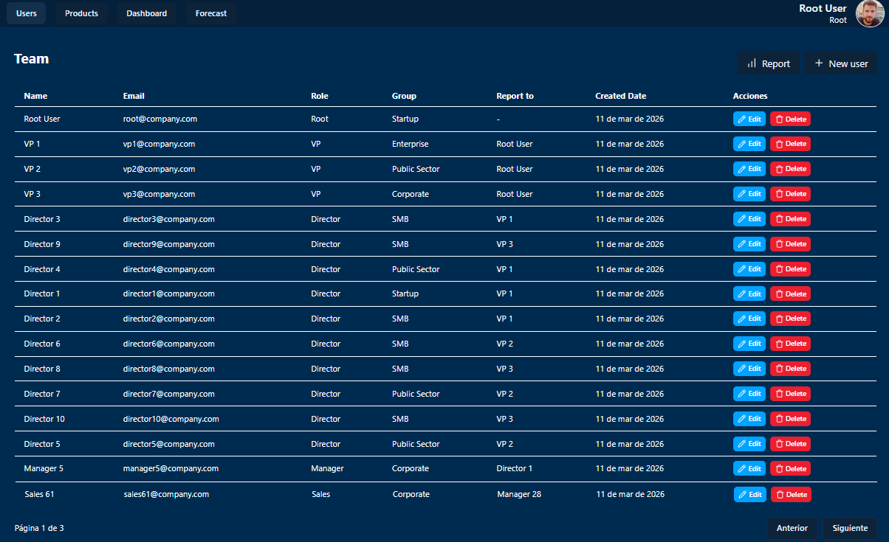
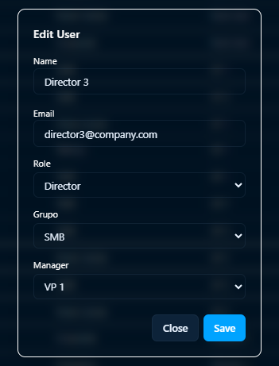

# React SaaS Dashboard Analytics

A modern SaaS dashboard built with React, featuring user management, hierarchical structures, and data-driven forecasting.

> Includes a forecasting microservice powered by FastAPI (Python) using Linear Regression.

## 🚀 Features

- User Management (CRUD)
- Hierarchical User Structure (Manager relationships)
- Data-driven Forecast Analytics (FastAPI microservice)
- Reusable Components (DataTable, Modals, Charts)
- Modern UI with Tailwind CSS
- Multi-backend integration (Java, Node.js, FastAPI)

## 🧠 Key Highlights

- Clean architecture with separated layers (features, services, components)
- Scalable and reusable component design
- Multi-backend architecture (Java + Node.js + Python)
- Integration with a forecasting microservice
- Focus on real-world SaaS patterns

## 🏗️ Architecture

- Frontend: React + Tailwind CSS
- Backend Services:
  - Java (Spring Boot) → core business logic
  - Node.js → API services / integrations
- ML Service:
  - FastAPI (Python) → Forecasting via Linear Regression
- Communication:
  - REST APIs between services

## 🛠️ Tech Stack

- React
- Vite
- Tailwind CSS
- Axios
- TypeScript

## 📸 Screenshots

### Forecast Analytics
> Data-driven forecasting powered by a FastAPI microservice

### User Management

### User Modal
